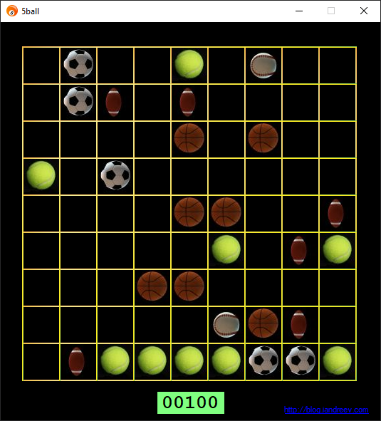

# 5ball

# Usage

5ball is a single player board game. Your task is to arrange 5 or more of the same balls horizontally, vertically or diagonally. Once you do that they will disappear. You can move a ball anywhere by dragging and dropping the ball on the screen. 
The challenge is that anytime you move a ball, 3 more balls appear. The game is over when you can't move any balls. It's quite difficult and the games end up fast.

You don't have to start the game. Just drag and drop an existing ball somewhere.

# Download

You can clone the source and compile on your own or you can run the executable that you can find under the releases section.

Have fun!